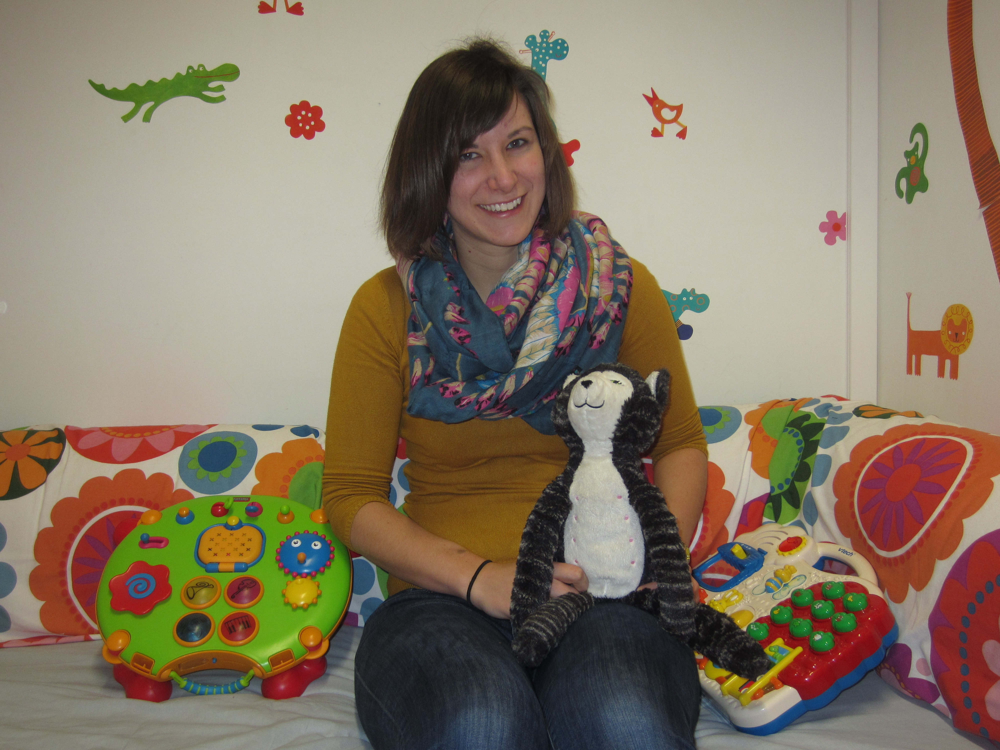

----

```{r setup_cv, include=FALSE}
knitr::opts_chunk$set(echo = FALSE, warning = FALSE, tidy = TRUE, message = FALSE, error = FALSE)
library(vitae)
library(scholar)
library(papaja)
```

<div class = "row">
  
<div class = "col-md-4">
<center></center>
</div>
  
<div class = "col-lg-6">
I'm currently a Postdoctoral Research Fellow at the University of Maryland. Together with [Rochelle Newman](https://hesp.umd.edu/facultyprofile/newman/rochelle), I'm investigating how infants, toddlers, and adults begin to learn a foreign language at first exposure. I'm especially interested in how L1 knowledge helps and hinders this process.

From 2014-2017, I was a Postdoctoral Researcher working at the Université Paris Descartes with [Thierry Nazzi](https://incc-paris.fr/people/thierry-nazzi/). I investigated how infants process consonants and vowels during early word learning and recognition.  I was especially interested in how this processing changes over the first year of life and how this relates to later language outcomes.

In 2013 I completed my PhD at the Georg-August-Universität-Göttingen under the supervision of [Nivedita Mani](https://www.psych.uni-goettingen.de/en/lang/team/mani-nivedita). My dissertation focused on how bilingual adults and toddlers activate words from both of their languages during lexical processing.
</div>
</div> 


