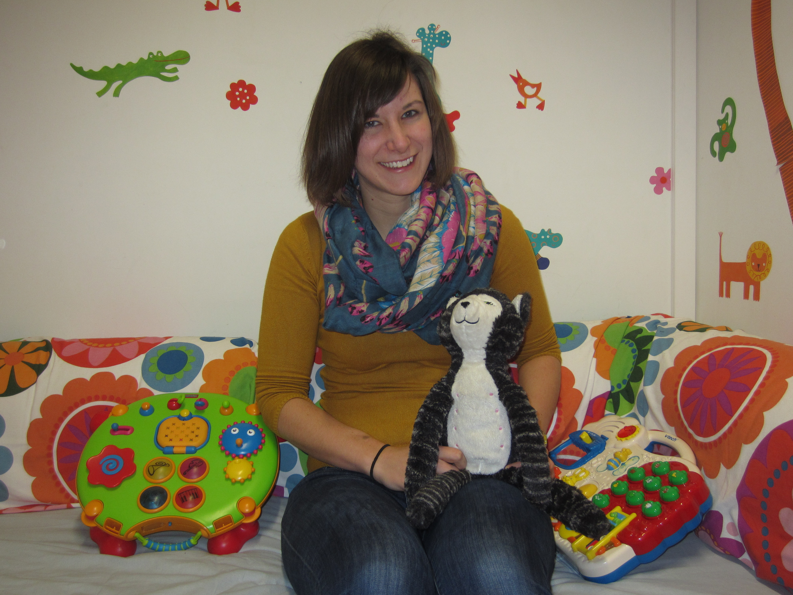

----

```{r setup_cv, include=FALSE}
knitr::opts_chunk$set(echo = FALSE, warning = FALSE, tidy = TRUE, message = FALSE, error = FALSE)
library(vitae)
library(scholar)
library(papaja)
```

<div class = "row">
  
<div class = "col-md-4">
<center></center>
</div>
  
<div class = "col-lg-6">
**Starting March 2026 I am on maternity leave**

In April 2026 I joined the Seminar for [English Philology](https://uni-goettingen.de/en/119637.html) at the Georg-August-Universität-Göttingen. I'm working towards my Habilitation in speech segmentation abilities in *ab initio* and L2 learners. I also lead the and the ManyBabies-AtHome Word Recognition project, which is funded by an HK 3.0 grant awarded to my collaborator Prof. Eon-Suk Ko at Chosun University (South Korea).

In January 2023 I became the Media Coordinator for the IASCL (International Association for the Study of Child Language). I take care of the [IASCL website](https://www.childlanguage.org/) as well as social media sites, including pages on  [BlueSky](https://bsky.app/profile/iasclchildlang.bsky.social) and [LinkedIn](https://www.linkedin.com/company/iascl/). I also conduct video interviews with child language researchers that can be found on our [YouTube channel](https://www.youtube.com/@childlanguage).

From 2022-2026, I was a researcher and lecturer in the English Linguistics department of [Holger Hopp](https://www.tu-braunschweig.de/en/anglistik/seminar/linguistik/team/hopp) at the Technical University of Braunschweig, where I taught and co-lead the DFG-funded [Ini-Seg Project](ini-seg.de).

From 2019-2022 I was an Akademische Rätin (senior postdoctoral researcher) in the German Linguistics department of [Sarah Schimke](http://www.schimke.germanistik.tu-dortmund.de/cms/de/home/Mitarbeiter/Professorin/Schimke.html) at the Technical University of Dortmund. I taught classes in German Linguistics, Bilingualism, and Psycho- and Neurolinguistics.

From 2017-2019 I was a Postdoctoral Research Fellow at the University of Maryland. Together with [Rochelle Newman](https://hesp.umd.edu/facultyprofile/newman/rochelle), I'm investigating how infants, toddlers, and adults begin to learn a foreign language at first exposure. I'm especially interested in how L1 knowledge helps and hinders this process.

From 2014-2017, I was a Postdoctoral Researcher working at the Université Paris Descartes with [Thierry Nazzi](https://incc-paris.fr/people/thierry-nazzi/). I investigated how infants process consonants and vowels during early word learning and recognition.  I was especially interested in how this processing changes over the first year of life and how this relates to later language outcomes.

In 2013 I completed my PhD at the Georg-August-Universität-Göttingen under the supervision of [Nivedita Mani](https://www.psych.uni-goettingen.de/en/lang/team/mani-nivedita). My dissertation focused on how bilingual adults and toddlers activate words from both of their languages during lexical processing.
</div>
</div> 


