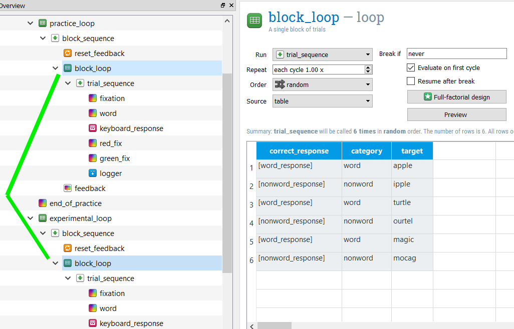
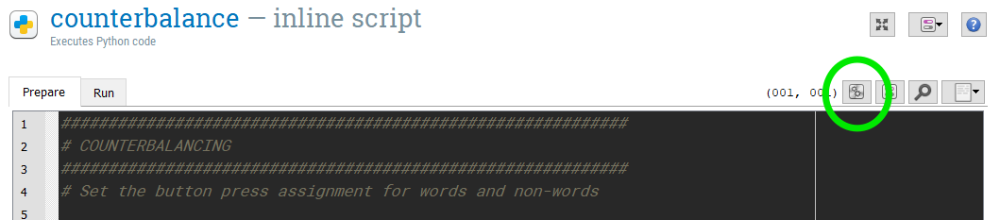
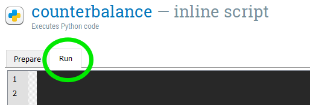
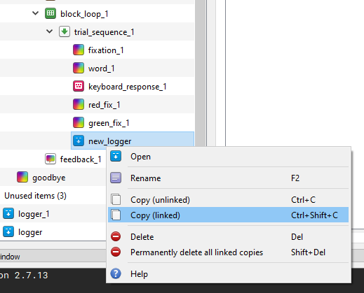

```{r setup, include=FALSE}
knitr::opts_chunk$set(echo = TRUE)

library(reticulate)

#use_python("C:/Program Files (x86)/OpenSesame/python")
# py_install("datamatrix")
# py_install("pseudorandom")

```


# Explore the Open Sesame Lexical decision experiment

*In this section, we will open and inspect the Open Sesame Lexical decision experiment of the tutorial. You will learn about Open Sesame variables and inline scripting.*

**Overview of the Experiment**

Independent variable

* Category (word/nonword)
    + This is a **within-subjects** manipulation, as all participants respond to word and nonword items

Dependent variable(s)

* Reaction time of keypress (in milliseconds)
* Accuracy of keypress (correct, incorrect)

## Step 1: Load the Lexical decision experiment pre-prepared by Open Sesame

When you start Open Sesame, click on "Tools > Example Experiments". This will bring up a menu of all the available example experiments in Open Sesame. Scroll down and click on "Lexical-decision task". This will load the example Lexical decision experiment. Save this experiment in your tutorial folder by clicking "File > Save as". Its good practice to regularly save your experiment so that you don't lose your progress!


## Step 2: Run yourself in the Lexical decision experiment and think about its design

Run yourself in the Experiment by clicking the big green triangle. Remember the [instructions from the Beginner Tutorial](https://osdoc.cogsci.nl/3.3/tutorials/beginner/#step-13-run-the-experiment) which describe how to run yourself in Open Sesame Experiments. Give yourself the subject number "999". You should get in the habit of using this subject number when testing out your experiment, so that you don't actually erase data for actual participants in the future! Since our participant numbers for a particular study are not likely to approach 1000, you will always know that you can write over this participant file. It will be saved in the same folder that you saved the experiment in.

While running yourself in this experiment, think about the aspects of this experiment that you might want to use in your own experiment:

* Instruction screen
* Practice Phase
* Feedback: Red or green color indicating accuracy after each keypress
    + We'll focus on this aspect more below
* Feedback: Summary of response accuracy and response time at the end of each block.
    + This was described in [Step 10 of the Beginner Tutorial](https://osdoc.cogsci.nl/3.3/tutorials/beginner/#step-10-draw-the-feedback-item)
* Counterbalancing word/nonword response across subjects
    + We'll focus on this aspect more below

## Step 3: Familiarize yourself with the new "counterbalance" inline script

Open and inspect the "counterbalance" inline script. If you ran yourself with subject number 999, an odd number, the program should have told you to press “z” when the string of letters was a word, and “m” when it was a nonword. If your subject number was even, then the assignment of keys would have been reversed. This is exactly what is written in the code, it tells Open Sesame to assign the button for word responses to "z" and for nonword responses to "m" for odd numbered subjects, and in all other cases (even numbered subjects) to assign the reverse. This is a **between-subjects** manipulation, because it counterbalanced word/nonword button assignments across subjects. Inline scripts can also be used to accomplish within-subjects manipulations. When we start to edit this inline script later, we'll change this code. This step is also described in [Step 3 of the Advanced Tutorial](https://osdoc.cogsci.nl/3.3/tutorials/advanced/#step-3-implement-counterbalancing)

```{python, eval = FALSE}

if var.subject_parity == 'odd':
  var.word_response = 'z'
  var.nonword_response = 'm'
else:
  var.word_response = 'm'
  var.nonword_response = 'z'  

```


## Step 4: See how variables from the inline script are used in Sketchpad objects

We can next see how this information is used in the rest of the experiment, starting with Sketchpad objects. Open and inspect the sketchpad “instructions. Here we can see how the information given in the "counterbalancing" inline script is translated into the instructions given to the participant. For example, the "var.word_response" given in the "counterbalance" inline script (here "z") is then printed out anywhere that [word_response] is given (see picture below). You can look at the assignment of variables by opening the [Variable inspector](https://osdoc.cogsci.nl/3.3/manual/variables/#the-variable-inspector).

```{r Instructions_image, echo= FALSE, out.width = "50%", fig.align="center"}

knitr::include_graphics("Tutorials/Lexical_Decision/pictures/Instructions.png")

```


## Step 4: See how variables from the inline script are used in Loop objects

Open and inspect the "block_loop" loop. This loop gives important information about the design of the experiment, telling it the item to present the participant (target), what condition this item belongs to (category, our independent variable) and what the correct keyboard response is (correct_response). As you can see, the actual keyboard responses “z” and “m” are not written here. Instead, they are decided in the counterbalance inline script, as we discussed in the previous step. By calling these previously defined variables in the column correct response, using brackets ([word_response]; [nonword_response]), Open Sesame knows to use the values for these previously defined variables.


## Step 5: Give per trial feedback

As you may recall while completing the experiment yourself, if you answered incorrectly, the fixation turned red and if you answered correctly, the fixation turned green. Recalling the “block_loop”, the correct_response is defined by which category (word, nonword) the item belongs to. Since the correct keypress (“m” or “z”) is counterbalanced across participants, the correct_response is defined using [word_response] and [nonword_response]. If the variable [correct_response] is defined in Open Sesame, it can be also called using [correct].

Open the sequence "trial_sequence". Here, the column "Run if" is used to define whether the red_fix or green_fix sketchpads should be shown. If the response is correct ([correct] = 1) then the green_fix will be shown. If the response is incorrect ([correct] = 0) then the red_fix will be shown. You can read more about per-trial feedback in [Step 8 of the Intermediate Tutorial](o	https://osdoc.cogsci.nl/3.3/tutorials/intermediate/#step-8-give-per-trial-feedback)


```{r per_trial_feedback_image, echo= FALSE, out.width = "50%", fig.align="center"}

knitr::include_graphics("Tutorials/Lexical_Decision/pictures/Per_trial_feedback.png")

```


# Edit the Lexical Decision experiment: Create an experimental Loop and pseudorandomize the trials

*In this section, we will use an inline script to create and pseudorandomize the information in a loop. We're going to make the experiment longer and then set some pseudorandomization constraints, specifically that the same target item (i.e. apple) isn’t presented within 5 trials of one another and that no more than 3 trials from the same category (i.e. word) will be presented in a row. *

**If you are creating an experiment to be run online using OSWeb, you will be unable to include the features given in this section in your experiment. A list of supported functions can be found [here](https://osdoc.cogsci.nl/3.3/manual/osweb/osweb/#supported-functionality). To read more about running Open Sesame Experiment online using OSWeb, check out this [link](https://osdoc.cogsci.nl/3.3/manual/osweb/osweb/) or complete the Tutorial [A Lexical Decision Experiment in OSWeb (Open Sesame online)](Tutorials_Open_Sesame_Lexical_decision_OSWeb.html) **

## Step 1: Unlink the "block_loop" loops

Right now, both the "practice_loop" and "experimental_loop" use the same "block_loop" loop. You can see this by clicking on "block_loop". Both instances are highlighted (see below). In order to use an inline script to create the information in the "block_loop" of the "experimental_loop", we need to unlink these loops.

```{r linked_loops_image, echo= FALSE, out.width = "50%", fig.align="center"}



```

Right click "experimental_loop" and select "Copy (unlinked)". This loop is now saved to the clipboard. Right click "end_of_practice" and select Paste. This creates "experimental_loop_1", which is a copy of "experimental_loop" but is no longer linked to "practice_loop". Go ahead and delete the old "experimental_loop" by right clicking on it and selecting "Delete".

## Step 2: Adding more trials to a loop

If we wanted to simply add more trials to the experiment, we can now because the practice and experimental loops are now unlinked. The simplest option would be to open "block_loop_1" within the "experimental_loop" and to select "2" (or whatever multiple you wish) under Repeat. Do not do this however! Having this set to repeat twice will interfer with our pseudorandomization.

```{r set_repeat_image, echo= FALSE, out.width = "50%", fig.align="center"}

knitr::include_graphics("Tutorials/Lexical_Decision/pictures/set_repeat.png")

```


## Step 3: Edit subjects counterbalancing for debugging

Open the "counterbalancing" inline script. Delete the existing code and type the following:

```{python}
############################################################
# COUNTERBALANCING
############################################################
# Set the button press assignment for words and non-words


# Comment out the following line until we're ready to run the experiment. This line takes the typed in subject number and converts it to a "var." variable to be used in the Open Sesame environment. We don't want to use that yet, because we won't be able to run our code!
#sub_num = var.subject_nr
sub_num = 999

if sub_num%2 == 1:
	word_response = 'z'
	nonword_response = 'm'
else:
	word_response = 'm'
	nonword_response = 'z'	

```

Later in our tutorial we will change this code so that we can use the typed in subject number. But for now, we are assigning all subjects the number "999".

The rest of the code accomplishes what the previous code did. The code "if sub_num%2 == 1:" uses the "%" operator. This returns the Modulus, or the remainder when the first operand is divided by the second. This would give us the answer of 1, an odd number just as in the previous code, but we no longer need to use Open Sesame environment variables to accomplish this.


## Step 4: Running code in the Debugging Window

Open up the Debus window. You can do this by clicking "View > Show Debug window". Then, you can run the code you just typed in the "counterbalance" inline script by higlighting/selecting those lines of text and pressing the "Run selected text" button. Its here in this picture:

```{r run_selected_text_image, echo= FALSE, out.width = "75%", fig.align="center"}



```

The code should appear in the Debug window. Type "word_response" into the Debug Window. You should get the following output:

```{python}

word_response

```

If this worked correctly, congratulations, you've just edited python code! If you want to learn more about editing python code and inline scripts in Open Sesame, I recommend checking out their [Python Tutorial](https://osdoc.cogsci.nl/3.3/manual/python/about/).

## Step 5: Recreate the "block_loop_1" loop using DataMatrix

In the "counterbalance" inline script, navigate from the "Prepare" to the "Run" tab. Where we put our code here has to do with the [Prepare-run strategy](https://osdoc.cogsci.nl/3.3/manual/prepare-run/) of Open Sesame.

```{r prepare_run_image, echo= FALSE, out.width = "50%", fig.align="center"}



```

We'll start by using DataMatrix to recreate the columns category and item from "block_loop_1". The relationship between these two variables is static, so this is relatively straightforward. Type in the following code, and then run the code! 


```{python}
############################################################
# CREATE BLOCK LOOP FOR EXPERIMENTAL LOOP
############################################################
# Set the values for variables category and target

# import the datamatrix library, specifically the function DataMatrix
from datamatrix import DataMatrix

# create a datamatrix object with 4 rows
dm = DataMatrix(length=6)

dm.target = 'apple', 'ipple', 'turtle', 'ourtel', 'magic', 'mogac'
dm.category = 'word', 'nonword', 'word', 'nonword', 'word', 'nonword'

#print(dm)

```

When you type "print(dm)" into the Debug window, you should get the following output:

```{python}

print(dm)

```

This calls the DataMatrix variable you just create (dm) and displays its contents.

## Step 6: Create a "correct_response" column

Now, we want to add the “correct_response” column to our DataMatrix, just like in the “block_loop”. Type the following code into the “counterbalance” inline script and then run the code:


```{python}

# set the values for the variable correct_response
dm.correct_response = nonword_response
dm.correct_response[dm.category == 'word'] = word_response


```

* The first line in this bit of code says that all the values in the column correct_response should be those set in the nonword_response variable (“m” in our case).
* The second line in this bit of code says that when the column category holds the value ‘word’, to set the value of the column correct_response to that of the word_response variable

This should produce the following DataMatrix when we type “print(dm)” in the Debug window. As you can see, the correct response button for our “odd” numbered participant (999) are correctly assigned.

```{python}

print(dm)

```


## Step 7: Adding more trials (rows) to a DataMatrix

We now have the 6 trials described by in the original version of this experiment in our object “dm”. But we want to increase the trials! We can double the trials by typing the following and running the code:

```{python}

# double the number of trials
dc = dm << dm

```

Now, when we display the contents of “dc” (type dc or print(dc) into the Debug window), our new object, we see that we have 12 trials.

```{python}

print(dc)

```

Now, it hopefully becomes apparent why we would want to include randomization, or more specifically pseudorandomization. In its current form, this experimental design would present all trials in this exact order.

## Step 8: Pseudorandomize the order of trials

We’re going to set some constraints for the order of trials and then allow Open Sesame to shuffle up the trials for us. Specifically, we want to make sure that the same target item (i.e. apple) isn’t presented within 5 trials of one another and we don’t want to have more than 3 trials from the same category (i.e. word) presented in a row. We’ll use the package pseudorandom to accomplish this. Type in the following code into the “counterbalance” inline script:

```{python}

############################################################
# PSEUDORANDOMIZE ORDER
############################################################

from pseudorandom import Enforce, MaxRep, MinDist

# make it in to an Enforce object
ef = Enforce(dc)

ef.add_constraint(MaxRep, cols=[dc.category], maxrep=3)
ef.add_constraint(MinDist, cols=[dc.target], mindist=5)

dm2 = ef.enforce()


```

* Line 1: Loads from the pseudorandom package the functions Enforce, MaxRep, and MinDist.
* Line 2: We make our object “dc” into the Enforce object “ef”. This is a requirement so that the following functions can work
* Line 3: Set the MaxRep or maximum repetition for values that are the same in the category column. Here, we’re saying we don’t want any category to be repeated more than 3 times in a row.
* Line 4: Set MinDist or minimum distance between the same values in the target column. Here, we’re saying we don’t want the same target to occur within 5 trials of its last appearance.
* Line 5: The enforce function carries out our MaxRep and MinDist and saves the resulting DataMatrix object to "dm2".

When we inspect the resulting dm2, we can check whether our constraints were met. They were!

```{python}

print(dm2)

```

## Step 9: Set our DataMatrix object variables for the experimental "block_loop_1"

We've recreated "block_loop_1" as a DataMatrix object and added pseudorandomization. Now, we want to make sure that the DataMatrix object is available to the rest of the Open Sesame environment. To do that, we'll set some experimental variables using the function *exp.set()*. This is Open Sesame code, and we won't be able to run this using the Debug window. Type the following into the "counterbalance" inline script.

```{python, eval = FALSE}

############################################################
# SET OUR DATAMATRIX VARIABLES FOR THE EXPERIMENTAL BLOCK_LOOP
############################################################

# set a ticker
r_ticker = 0

for row in dm2:
	a_trial = row
	exp.set('exp_category_%i' % r_ticker, a_trial['category'])
	exp.set('exp_target_%i' % r_ticker, a_trial['target'])
	exp.set('exp_correct_response_%i' % r_ticker, a_trial['correct_response'])
	r_ticker = r_ticker+1

```

This code creates a loop, indicated by the line starting with "for". For every row in our DataMatrix object, we are going to set three different variables in the Open Sesame Environment: category, target, and correct response.

* Line 1: Outside of our loop, we are going to set the variable "r_ticker" to 0. This is just a way to keep track of the row number that we are on. In our DataMatrix object, the first row is marked by 0. You can see this in the previous output in the "#" column.
* Line 2: This is where we start our loop. It means, for every row in object dm2, do the following
* Line 3: subset the row and call it "a_trial"
* Line 4: set the experimental variable "exp_category_X" using the information found in the category column for this particular row (a_trial['category']). The value "X" used here will be determined by the value of "r_ticker". If this is the first row, then the variable will be called "exp_category_0". If it is the second row, then "exp_category_1" and so forth. When these experimental variables are used elsewhere in the experiment, by calling [exp_category_0] or [exp_category_1], the value will come from our DataMatrix variable (i.e. nonword, word).
* Line 5: This sets the experimental variable "exp_target_X" in the same fashion as line 4.
* Line 6: This sets the experimental variable "exp_correct_response_X" in the same fashion as line 4.
* Line 7: At the end of the loop, add one value to r_ticker, which will be used in the next iteration of the loop (i.e. 0, 1, 2, 3, 4, etc.)

## Step 10: Rename variables in "block_loop_1" to the environmental variables defined in our inline script

We need to update "block_loop_1" so that it is ready to recieve the values from the environmental variables we just defined in our inline script. Since this will change every time we run this experiment, we can't have any unchanging information in our "block_loop_1". Instead, we will type out the experimental variables here in the "block_loop_1". Furthermore, we've created a nice psedurandomized trial order, so we want to set the Order to "sequential" so that Open Sesame doesn't step in and randomize our nice order. Go ahead and do this now, as in this picture:


```{r exp_var_block_loop_image, echo= FALSE, out.width = "50%", fig.align="center"}

knitr::include_graphics("Tutorials/Lexical_Decision/pictures/exp_var_block_loop.png")

```


## Step 11: Add word_response and nonword_response as environmental variables

Finally, we don't want to forget to set the word_response and nonword_response variables so that the rest of the experiment knows what they mean! Type the following into the inline script under the Prepare tab, at the end:


```{python, eval = FALSE}

var.word_response = word_response
var.nonword_response = nonword_response

```

## Step 12: Change subject number back to an environmental variable

Earlier in this tutorial, we commented out a line so that we could debug our experiment. Now that its ready to go, we can uncomment this line, commenting out the one after it. Remember, this code is in the Prepare tab of our inline script.

```{python, eval = FALSE}
############################################################
# COUNTERBALANCING
############################################################
# Set the button press assignment for words and non-words


# Now that we're ready to run this experiment, commenting out #sub_num = 999
sub_num = var.subject_nr
#sub_num = 999

if sub_num%2 == 1:
	word_response = 'z'
	nonword_response = 'm'
else:
	word_response = 'm'
	nonword_response = 'z'	

```


## Step 13: Run the experiment!

Just as in the Beginner Tutorial and the previous running of this experiment, remember to use subject number "999" to get in the habit of not writing over important participant data files!

# Prepare for data analysis

## Step 1: Inspect the log file

After running the experiment in Step 13, open the subject log file that is created. If you used subject number "999", this file should be called "subject-999.csv". The creators of Open Sesame recommend logging all variables with logger items. This is the default in Open Sesame. I personally find this log output to be very abstruse. For this reason, I often create my own log file, in addition to the default log file created by Open Sesame. Read more about logger items [here](https://osdoc.cogsci.nl/3.3/manual/logging/).

## Step 2: Add linked logger items

The logger items in our experiment are currently unlinked. This can lead to messy data, as Open Sesame warns us. Delete these 2 logger items (one in the practice_loop and one in the experimental_loop). Drag a new logger item to the block_loop of your experimental_loop, placing it after your green_fix sketchpad. Copy this new logger item by right clicking it and selecting "Copy (linked)". Then, right click your green_fix sketchpad in the block_loop of your pratice_loop and select "Paste". These two logger items should now be linked to one another.

```{r copy_linked_logger_image, echo= FALSE, out.width = "50%", fig.align="center"}



```

## Step 3: Create a custom logger file

Let's make a custom logger file that's easier to read than the default. To do so, type the following into the "counterbalance" inline script on the Run tab:

```{python, eval = FALSE}

#####################################################
# CREATE CUSTOM LOGGER FILE
#####################################################


# import the csv module which we will use to create and write to a new csv file
import csv

# need to have the subject name as a string variable
subj = str(var.subject_nr)

# determine what folder the current experiment is in, call it "path"
# IMPORTANT! UPDATE THIS TO YOUR TUTORIAL FOLDER, OR WHEREVER FOLDER YOUR EXPERIMENT IS IN
path = "C:\\Users\\user\\Documents\\TU_Dortmund\\Labor\\Tutorials\\Lexical Decision Template\\"

# create a name for the csv file we will create, and using path to specify where it will be saved
log_file = path + subj + '_sum_log.csv'

# Open 'log_file'
with open(log_file, 'wb') as csvfile:
	filewriter = csv.writer(csvfile, delimiter=',',
							quotechar='|', quoting=csv.QUOTE_MINIMAL)
# in the next line, we specify the names of the columns of variables that we want in our log file
	filewriter.writerow(['subject', 'category', 'target', 'accuracy', 'rt', 'key_pressed', 'nonword_response', 'word_response', 'trial']) # write column head


```

It is very important that you edit this code to contain the folder that your Open Sesame experiment is located in!

## Step 4: Log important variables to our custom logger file

Drag a new inline script into the block_loop of your experimental_loop. You can place this after the logger item we added in Step 2. We now want to set all of our variables that we want to record in our logger file and then write these variables to that file. Type the following in the inline script:

```{python, eval = FALSE}

# define each of the variables we want
# select the current row (count_trial_sequence_1) of our block_loop_1 (dm2)
# and give the corresponding variable

Category = dm2[var.count_trial_sequence_1].category# word/nonword
Target = dm2[var.count_trial_sequence_1].target # target word
Accuracy = var.correct # accuracy of participant answer
rt = var.response_time # reaction time
key_pressed = var.response_keyboard_response_1 # key pressed, 'm' or 'z'
nonword_key = var.nonword_response # response key for nonwords
word_key = var.word_response # response key for words
trial = var.count_trial_sequence_1 # trial number

# gather these variables together into one object, te
te = [var.subject_nr, Category, Target, Accuracy, rt, key_pressed, nonword_key, word_key, trial]


import csv

# open the csv file we created in the counterbalance inline script
with open(log_file, 'ab') as f:
	writer = csv.writer(f, delimiter=',',
							quotechar='|', quoting=csv.QUOTE_MINIMAL)
# write the te object to this csv file as the next row
	writer.writerow(te)

```

Each of these variables is already defined in the default logger item that Open Sesame automatically creates. We're just putting them together in a much more tidy manner. You can check these variables by opening "subject-999.csv" and searching among the column names to make sure that these are the variables that we want to save.

## Step 5: Run the experiment!

Just as in the Beginner Tutorial and the previous running of this experiment, remember to use subject number "999" to get in the habit of not writing over important participant data files!

## Step 6: Open and inspect our "999_sum_log.csv" log file

After running the expeirment in the last step, you should now have the file "999_sum_log.csv" in your experimental folder. Open this file. It should look like this:

``` {r echo = FALSE}

log_file <- read.csv("Tutorials/Lexical_Decision/999_sum_log.csv")

log_file

```

When thinking about the variables you want to include in your logger file, make sure you think about what you need to answer your research question. Lexical decision tasks are usually much more complicated than our current task, for example using different kinds of target words (semantically related vs. unrelated words) or testing different groups of participants (monolinguals vs. bilinguals). We always want to have the following information:

* subject identification code (subject)
* item information (target)
* independent variable(s) (category)
* dependent variable(s) (accuracy; rt)
* trial number (trial)

In addition, we can use the logger file to make sure that our experiment is doing what we asked it to. That's why I included "key_press", "nonword_response", and "word_response", so that I can check and make sure that correct and incorrect button presses are being recorded correctly. Always err on the side of including more information than you need!

# If you get stuck

If you run into trouble, you can find a completed, working version of this experiment [here](Tutorials/Lexical_Decision/Lexicaldecision_finished.zip). Download and unzip the file. If "Lexicaldecision_finished.osexp" works and you are able to run the experiment, then you have made a mistake in your editing of the experiment. Go back and work through this tutorial again, following the steps closely. If you are unable to run the experiment, then this is more tricky to solve. Perhaps you don't have a module installed correctly ([Installing packages, plugins, and extensions](https://osdoc.cogsci.nl/3.3/manual/environment/)) or your installation was corrupt ([Download Open Sesame](https://osdoc.cogsci.nl/3.3/download/)). When something doesn't work right, Open Sesame will also give information about the error and where it is occuring. Use this information to track down a solution.

If you're having a hard time figuring out the answer to your question, try typing in keywords to the [Open Sesame Forum](https://forum.cogsci.nl/categories/opensesame). Often, someone else has had your problem previously and the way to solve it has been documented.

Sometimes, though, you won't be able to find the answer to your question in the Open Sesame Forum. If it concerns the inline script, you may be able to try your luck by searching for python solutions. Search for "python" + "[your question keywords]" and potential solutions will come up. Finding a solution may be frustrating at first, but try reformulating [your question keywords]. I promise, you'll get better at this with time, but it does take practice.

