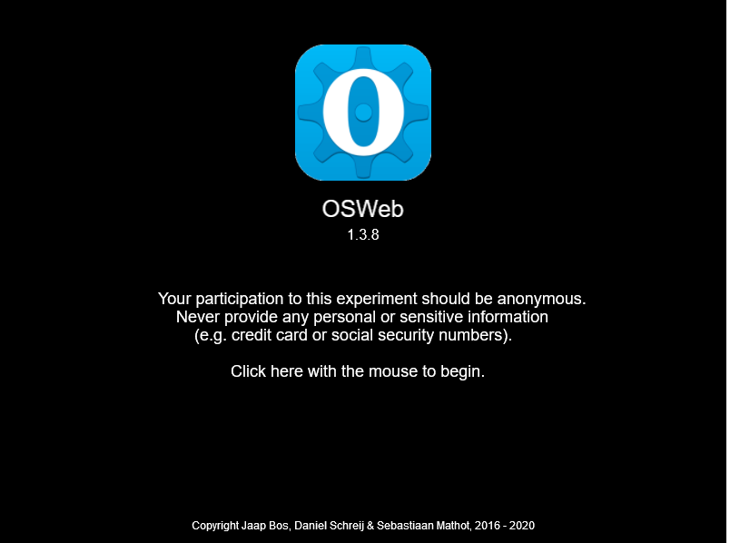
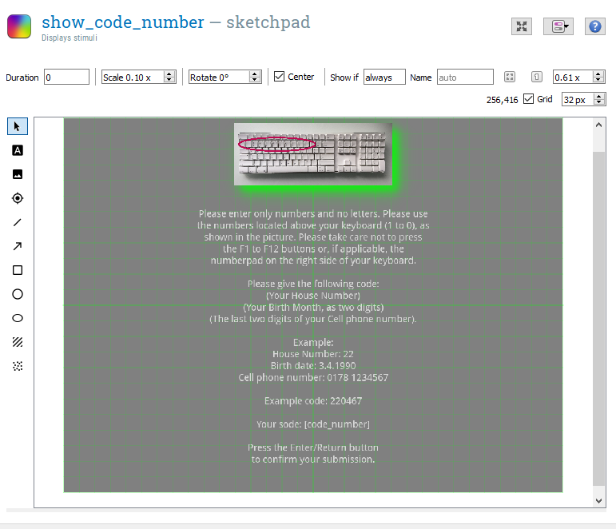
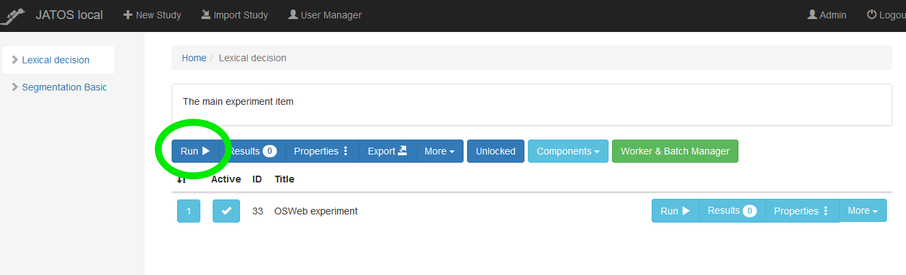
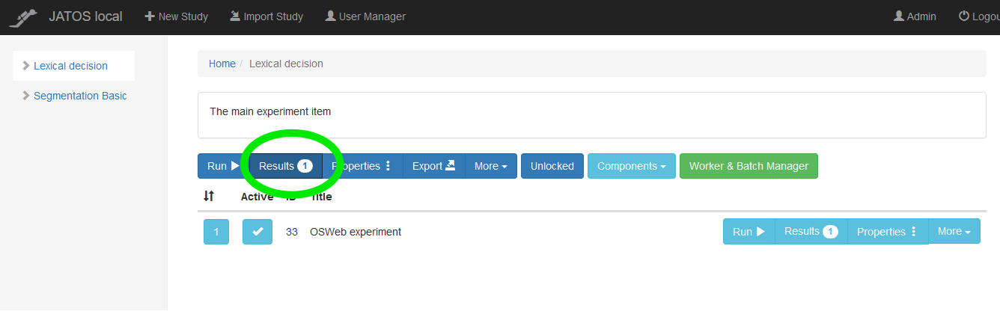
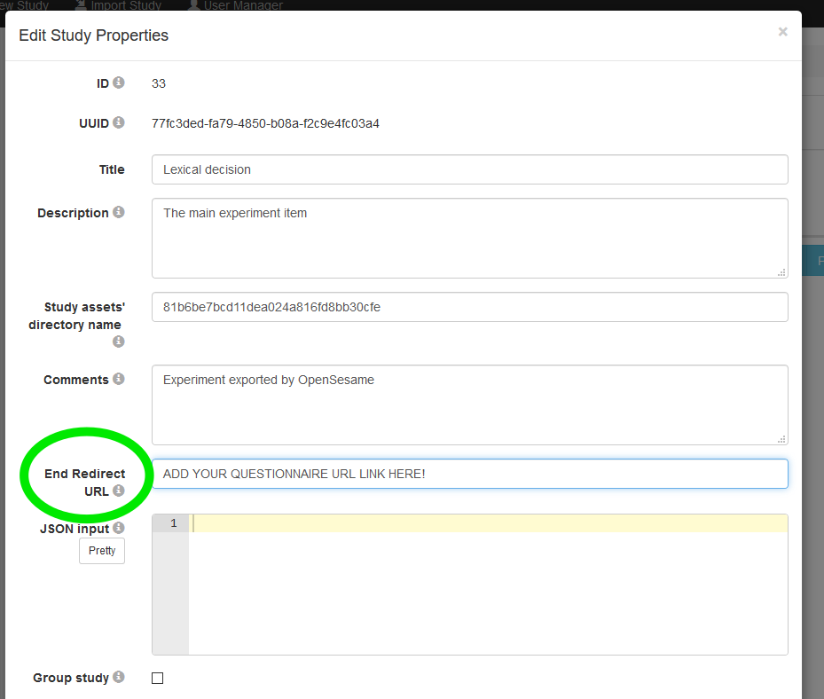
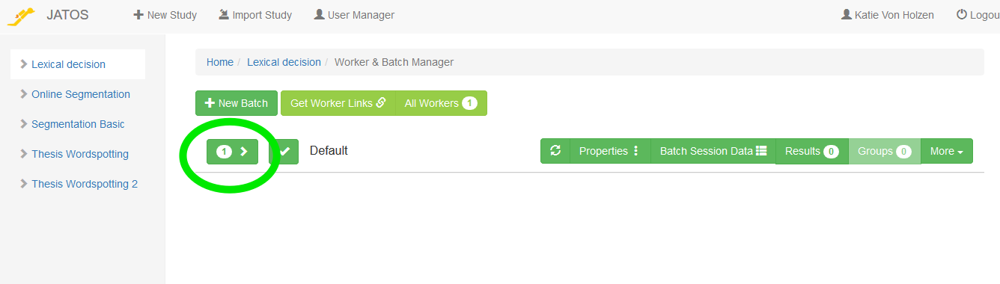

```{r setup, include=FALSE}
knitr::opts_chunk$set(echo = TRUE)
library(reticulate)

# use_python("C:/Program Files (x86)/OpenSesame/python")
#py_install("datamatrix")
#py_install("pseudorandom")

```

*Steps 1-5 in this tutorial are identical to the [Lexical Decision Tutorial](Tutorials_Open_Sesame_Lexical_decision.html). If you have already completed that tutorial, you can skip ahead to the section [Edit the Lexical Decision experiment for OSWeb](#OSWeb_edit).*

# Explore the Open Sesame Lexical decision experiment

*In this section, we will open and inspect the Open Sesame Lexical decision experiment of the tutorial. You will learn about Open Sesame variables and inline scripting.*

**Overview of the Experiment**

Independent variable

* Category (word/nonword)
    + This is a **within-subjects** manipulation, as all participants respond to word and nonword items

Dependent variable(s)

* Reaction time of keypress (in milliseconds)
* Accuracy of keypress (correct, incorrect)

## Step 1: Load the Lexical decision experiment pre-prepared by Open Sesame

When you start Open Sesame, click on "Tools > Example Experiments". This will bring up a menu of all the available example experiments in Open Sesame. Scroll down and click on "Lexical-decision task". This will load the example Lexical decision experiment. Save this experiment in your tutorial folder by clicking "File > Save as". Its good practice to regularly save your experiment so that you don't lose your progress!


## Step 2: Run yourself in the Lexical decision experiment and think about its design

Run yourself in the Experiment by clicking the big green triangle. Remember the [instructions from the Beginner Tutorial](https://osdoc.cogsci.nl/3.3/tutorials/beginner/#step-13-run-the-experiment) which describe how to run yourself in Open Sesame Experiments. Give yourself the subject number "999". You should get in the habit of using this subject number when testing out your experiment, so that you don't actually erase data for actual participants in the future! Since our participant numbers for a particular study are not likely to approach 1000, you will always know that you can write over this participant file. It will be saved in the same folder that you saved the experiment in.

While running yourself in this experiment, think about the aspects of this experiment that you might want to use in your own experiment:

* Instruction screen
* Practice Phase
* Feedback: Red or green color indicating accuracy after each keypress
    + We'll focus on this aspect more below
* Feedback: Summary of response accuracy and response time at the end of each block.
    + This was described in [Step 10 of the Beginner Tutorial](https://osdoc.cogsci.nl/3.3/tutorials/beginner/#step-10-draw-the-feedback-item)
* Counterbalancing word/nonword response across subjects
    + We'll focus on this aspect more below

## Step 3: Familiarize yourself with the new "counterbalance" inline script

Open and inspect the "counterbalance" inline script. If you ran yourself with subject number 999, an odd number, the program should have told you to press “z” when the string of letters was a word, and “m” when it was a nonword. If your subject number was even, then the assignment of keys would have been reversed. This is exactly what is written in the code, it tells Open Sesame to assign the button for word responses to "z" and for nonword responses to "m" for odd numbered subjects, and in all other cases (even numbered subjects) to assign the reverse. This is a **between-subjects** manipulation, because it counterbalanced word/nonword button assignments across subjects. Inline scripts can also be used to accomplish within-subjects manipulations. When we start to edit this inline script later, we'll change this code. This step is also described in [Step 3 of the Advanced Tutorial](https://osdoc.cogsci.nl/3.3/tutorials/advanced/#step-3-implement-counterbalancing)

```{python, eval = FALSE}

if var.subject_parity == 'odd':
  var.word_response = 'z'
  var.nonword_response = 'm'
else:
  var.word_response = 'm'
  var.nonword_response = 'z'  

```


## Step 4: See how variables from the inline script are used in Sketchpad objects

We can next see how this information is used in the rest of the experiment, starting with Sketchpad objects. Open and inspect the sketchpad “instructions. Here we can see how the information given in the "counterbalancing" inline script is translated into the instructions given to the participant. For example, the "var.word_response" given in the "counterbalance" inline script (here "z") is then printed out anywhere that [word_response] is given (see picture below). You can look at the assignment of variables by opening the [Variable inspector](https://osdoc.cogsci.nl/3.3/manual/variables/#the-variable-inspector).

```{r Instructions_image, echo= FALSE, out.width = "50%", fig.align="center"}

knitr::include_graphics("Tutorials/Lexical_Decision/pictures/Instructions.png")

```


## Step 4: See how variables from the inline script are used in Loop objects

Open and inspect the "block_loop" loop. This loop gives important information about the design of the experiment, telling it the item to present the participant (target), what condition this item belongs to (category, our independent variable) and what the correct keyboard response is (correct_response). As you can see, the actual keyboard responses “z” and “m” are not written here. Instead, they are decided in the counterbalance inline script, as we discussed in the previous step. By calling these previously defined variables in the column correct response, using brackets ([word_response]; [nonword_response]), Open Sesame knows to use the values for these previously defined variables.


## Step 5: Give per trial feedback

As you may recall while completing the experiment yourself, if you answered incorrectly, the fixation turned red and if you answered correctly, the fixation turned green. Recalling the “block_loop”, the correct_response is defined by which category (word, nonword) the item belongs to. Since the correct keypress (“m” or “z”) is counterbalanced across participants, the correct_response is defined using [word_response] and [nonword_response]. If the variable [correct_response] is defined in Open Sesame, it can be also called using [correct].

Open the sequence "trial_sequence". Here, the column "Run if" is used to define whether the red_fix or green_fix sketchpads should be shown. If the response is correct ([correct] = 1) then the green_fix will be shown. If the response is incorrect ([correct] = 0) then the red_fix will be shown. You can read more about per-trial feedback in [Step 8 of the Intermediate Tutorial](o	https://osdoc.cogsci.nl/3.3/tutorials/intermediate/#step-8-give-per-trial-feedback)


```{r per_trial_feedback_image, echo= FALSE, out.width = "50%", fig.align="center"}

knitr::include_graphics("Tutorials/Lexical_Decision/pictures/Per_trial_feedback.png")

```


# Edit the Lexical Decision experiment for OSWeb {#OSWeb_edit}

*In this section, we will adapt the Lexical Decision Task experiment so that it is ready to be tested online using OSWeb and JATOS. Before you begin this section, please read through [the documentation on OSWeb](https://osdoc.cogsci.nl/3.3/manual/osweb/osweb/). Not all regular Open Sesame functions and features are available when using OSWeb. A list of supported functions can be found [here](https://osdoc.cogsci.nl/3.3/manual/osweb/osweb/#supported-functionality).*

## Step 1: Create Edit the counterbalance inline script

One of the biggest differences between a regular Open Sesame Experiment and an OSWeb experiment is that the former is based on python whil the latter is based on javascript. I (Katie Von Holzen) am only a beginner in python scripting and have barely written one line of independent code in javascript. That being said, though some [OSWeb Forum](https://forum.cogsci.nl/categories/osweb) sleuthing, I've found some nifty code that can help customize our experiments. The most important difference for us is that inline_script objects no longer work. Instead, we need to use inline_javascript objects, which are based on javascript. Drag one to your Overview area next to your old counterbalance inline_script and delete the old counterbalance inline_script.

```{r inline_javascript_image, echo= FALSE, out.width = "30%", fig.align="center"}

knitr::include_graphics("Tutorials/Lexical_Decision_OSWeb/pictures/inline_javascript.png")

```

Since we no longer have a counterbalance script, we should make a new one. Rename this inline_javascript "counterbalance" and in the Run tab place the following code:


```{js, eval=FALSE}

if (vars.subject_nr % 2 == 1) {
	vars.word_response = 'z'
	vars.nonword_response = 'm'
    vars.sub_parity = 'odd'
 } else {
	vars.word_response = 'm'
	vars.nonword_response = 'z'
    vars.sub_parity = 'even'
}

```

This javascript code accomplishes essentially the same goal as our previous counterbalance inline_script, this time using javascript!


## Step 2: Edit the instructions {#instructions}

Unfortunately, OSWeb does not support named elements in sketchpad objects. That means that the variables [word_response] and [nonword_response] can not be flexibly updated when using OSWeb. Never fear, however, as there is a workaround! We just need to create two different instruction sketchpads, one to be shown when the subject number is odd, the other when it is even. Rename the exisitng instructions sketchpad as "instructions_odd" and rewrite it so that it looks like this:

```{r instructions_odd_image, echo= FALSE, out.width = "50%", fig.align="center"}

knitr::include_graphics("Tutorials/Lexical_Decision_OSWeb/pictures/instructions_odd.png")

```

Then copy this sketchpad to create a second sketchpad, naming it "instructions_even". Rewrite this sketchpad such that the response for letters that form a word should be 'm' and letters that form a nonword should be 'm'.

Drag a new sequence item below your counterbalance inline_javascript item. Place both of the instruction sketchpads into this sequence. In the sequence object, edit the Run if statements for these sketchpads as follows:

```{r sequence_parity_image, echo= FALSE, out.width = "50%", fig.align="center"}

knitr::include_graphics("Tutorials/Lexical_Decision_OSWeb/pictures/sequence_parity.png")

```

## Step 3: Test our experiment using OSWeb {#test_osweb}

Our experiment should now work with OSWeb. These next instructions are similar to those given by Open Sesame for [Testing in a browser](https://osdoc.cogsci.nl/3.3/manual/osweb/osweb/#testing-in-a-browser). Click Tools -> OSWeb to bring up the OSWeb options. OSWeb first runs a compatibility check on our experiment and it looks like it is compatible so far.


```{r osweb_options_image, echo= FALSE, out.width = "50%", fig.align="center"}

knitr::include_graphics("Tutorials/Lexical_Decision_OSWeb/pictures/osweb_options.png")

```

To run the experiment, click "Test experiment in external browser". The loading screen should look like this:

```{r osweb_test_image, echo= FALSE, out.width = "50%", fig.align="center"}



```

Click on the screen and complete the experiment. If you encounter any issues, go through the [OSWeb Debugging suggestions](https://osdoc.cogsci.nl/3.3/manual/osweb/osweb/#debugging). The [OSWeb Forum](https://forum.cogsci.nl/categories/osweb) is also useful.


# Create a subject-specific code {#subject_code}

Participants aren't coming to our lab to complete the experiment; instead, they're completing it anonymously online. But, we may want to collect some demographic information about our participants. Unfortunately, the ability for OSWeb to create a questionnaire is limited. There are plenty of options available, from free, such as a [Google Form](https://www.google.com/forms/about/) or [Survey Monkey](https://www.surveymonkey.com/), to paid options, such as [Lime Survey](https://www.limesurvey.org/en/). The TU Dortmund has a Lime Survey subscription, so this is the option I use.

In order to connect the results we collect using our OSWeb experiment with results we want to collect with an online questionnaire, we need to be able to link the data. But, we also want to ensure the data privacy of our participants. Following the suggestions in [this Forum post](https://forum.cogsci.nl/discussion/5876/), I ask participants to use their House Number, Birth Month, and the last two digits of their cell phone number. These values are not likely to be forgotten (whereas a randomly chosen variable might be). Participants give this code in the OSWeb experiment as well as when filling out the questionnaire, enabling matching during data analysis.

## Step 1: Create a blank javascript variable to capture the subject code

First, we need to create a blank variable that we will fill with the subject's typed input. Drag a new inline_javascript object below (but not inside!) the sequence object we created in [Step 2: Edit the instructions](#instructions). Name this inline_javascript "constants" and paste the following code into the Run tab of this inline_javascript object:

```{js, eval=FALSE}

vars.block_count = 0
vars.code_number = ''
vars.response = ''

```

## Step 2: Create a loop to capture the subject code

Drag a loop object below the constants inline_javascript object. Drag a sequence object inside this loop object. Drag a sketchpad, keyboard_response, and inline_javascript object into this sequence. Add a feedback item after (but not inside!) the sequence item. Rename all of these new objects such that they match this picture:

```{r code_number_names_image, echo= FALSE, out.width = "50%", fig.align="center"}

knitr::include_graphics("Tutorials/Lexical_Decision_OSWeb/pictures/code_number_names.png")

```

In the code_loop object, change Break if from "never" to "[response] = return or [response] = enter". This will call the loop until the participant presses the Enter/Return button. Also, change Repeat from "each cycle 1.00 x" to "[response] = return or [response] = enter".

In the code_number_input keyboard_response object, add the following to Allowed responses: 1;2;3;4;5;6;7;8;9;0;backspace;return.

In the process_code_number_input inline_javascript object, paste the following code into the Run tab:

```{js, eval=FALSE}

console.log(vars.response)
if (vars.response in [0, 1, 2, 3, 4, 5, 6, 7, 8, 9]) {
	vars.code_number += vars.response.toString()
} else if (vars.response === 'backspace') {
	vars.code_number = vars.code_number.toString().slice(0, vars.code_number.toString().length - 1)
}

```

## Step 3: Edit the instructions for the code number

We next edit the sketchpad which will both explain to the participants how to create their own code and show them what they input live, allowing them to confirm that their code is correct. In the show_code_number sketchpad, add the following text (either in English or German). You may have to edit this text to make sure that each line fits on the sketchpad:

**German**

*Bitte geben Sie nur Zahlen und keine Buchstaben an. Bitte nutzen Sie die Zahlentasten oben auf der Tastatur (1 bis 0), wie im Bild dargestellt. Achten Sie darauf, nicht die Funktionstasten F1 bis F12 oder einen etwaig vorhandenen Nummerblock auf der rechten Seite der Tastatur zu verwenden.*

*Bitte geben Sie den folgenden Zugangsode an:*
*(Ihre Hausnummer)*
*(Ihren Geburtsmonat als zwei Ziffern)*
*(Die letzten zwei Ziffern Ihrer Handynummer). *

*Beispiel:*
*Hausnummer: 22*
*Geburtsdatum: 3.4.1990*
*Handynummer: 0178 1234567*

*Beispiel Zugangsode: 220467*

*Ihr Zugangsode: [code_number]*

*Drücken Sie die Eingabe Taste um Ihre Eingabe zu bestätigen.*

**English**

*Please enter only numbers and no letters. Please use the numbers located above your keyboard (1 to 0), as shown in the picture. Please take care not to press the F1 to F12 buttons or, if applicable, the numberpad on the right side of your keyboard.*

*Please give the following code:*
*(Your House Number)*
*(Your Birth Month, as two digits)*
*(The last two digits of your Cell phone number). *

*Example:*
*House Number: 22*
*Birth date: 3.4.1990*
*Cell phone number: 0178 1234567*

*Example code: 220467*

*Your code: [code_number]*

*Press the Enter/Return button to confirm your submission.*

As you can see in the instructions, a picture is alluded to. Download [keyboard.png](Tutorials\Lexical_Decision_OSWeb\pictures\keyboard.png) and place it in your file pool (see [Step 4 of the Beginner Tutorial](https://osdoc.cogsci.nl/3.3/tutorials/beginner/#step-4-add-images-and-sound-files-to-the-file-pool)). Add this picture to the sketchpad, at the top. You will likely have to scale down the image, I found that a cale of 0.10 x works well. Your sketchpad show_code_number should now look like this:


```{r show_code_number_image, echo= FALSE, out.width = "50%", fig.align="center"}



```

## Step 4: Edit the code number verification{#code_verify}

We want to double check that participants have given the correct code, otherwise we won't be able to match their experimental results with their questionnaire results. Paste the following text (German or English) into the verify_code_number feedback_item:

**German**

*Ihr Zugangscode ist [code_number]*

*(Ihre Hausnummer)*
*(Ihren Geburtsmonat als zwei Ziffern)*
*(Die letzten zwei Ziffern Ihrer Handynummer).*

*Wenn die Angaben richtig sind, drücken Sie eine beliebige Taste.*

*Ansonsten starten Sie das Experiment bitte neu.*

**English**

*Your code is [code_number]*

*(Your House Number)*
*(Your Birth Month, as two digits)*
*(The last two digits of your Cell phone number). *

*If this submission is correct, please press any key.*

*If this submission is incorrect, please restart the experiment.*

## Step 5: Test our experiment using OSWeb{#test_OSWeb2}

Follow the same steps in the [previous section](#test_osweb) to test the experiment using OSWeb


# Upload your experiment to local version of JATOS{#local_jatos}

Although our experiment now works in an external browser, it is right now only functional on our local computer. But, we want to send this experiment to subjects wherever they are, so we need to host the experiment on a web server. Unfortunately, this does cost money and can be a bit tricky. Fortunately, Dr. Von Holzen has paid for a service for students working with her. Below, we'll go through the steps for uploading our experiment to a web server using JATOS. To read more about this process, which is mirrored to a large extent below, [click here](https://osdoc.cogsci.nl/3.3/manual/osweb/jatos/).

This section can be followed to upload any experiment to a local version of JATOS.

## Step 1: Export the experiment as a JATOS study{#zip}

Click Tools -> OSWeb to bring up the OSWeb options. Click "Export experiment as JATOS study". This will save a .zip file of our OSWeb experiment.


```{r osweb_options_image2, echo= FALSE, out.width = "50%", fig.align="center"}

knitr::include_graphics("Tutorials/Lexical_Decision_OSWeb/pictures/osweb_options.png")

```

## Step 2: Install a local version of JATOS on your computer

First, you need to install a local version of JATOS on your computer, to make sure that everything is installed correctly. [Please follow the instructions given on the JATOS website for installation](https://www.jatos.org/Installation.html).

## Step 3: Open the JATOS GUI

If you just followed the installation instructions, you should have JATOS already running. If not, return to the installation instructions and open the loader file. For example, this is step 3 of [Installation MS Windows](https://www.jatos.org/Installation.html) and step 3 of [Installation MacOS X and Linux](https://www.jatos.org/Installation.html).

Copy and paste [http://localhost:9000/jatos/login](http://localhost:9000/jatos/login) into an open browser window. This should open the local version of the JATOS GUI on your computer. Login with username ‘admin’ and password ‘admin’.

## Step 4: Import your experiment in JATOS

In JATOS, click on "Import Study" at the top of the page. Select the .zip file that you created in [Step 1: Export the experiment as a JATOS study](#zip). You will be asked if you want to proceed. Click "Import".

```{r import_jatos_image, echo= FALSE, out.width = "50%", fig.align="center"}

knitr::include_graphics("Tutorials/Lexical_Decision_OSWeb/pictures/import_jatos.png")

```

If the study imported correctly, you should get a green notification and the study should appear in the menu on the left side of the screen.

```{r jatos_success_import_image, echo= FALSE, out.width = "100%", fig.align="center"}

knitr::include_graphics("Tutorials/Lexical_Decision_OSWeb/pictures/jatos_success_import.png")

```

## Step 5: Run the experiment using JATOS

Although we've already run the experiment using OSWeb, we also want to check that JATOS is running our experiment correctly. Click on the name of our study (it should be "Lexical decision") on the left hand menu of your screen. This will bring up the study's page. Click the main run button to test the experiment. This should bring up a new browser window that looks very similar to our previous test of the experiment. Go through and complete the experiment. If you encounter any issues, go through the [OSWeb Debugging suggestions](https://osdoc.cogsci.nl/3.3/manual/osweb/osweb/#debugging). The [OSWeb Forum](https://forum.cogsci.nl/categories/osweb) is also useful.

```{r run_jatos_import_image, echo= FALSE, out.width = "100%", fig.align="center"}



```

## Step 6: Download our results

Now that you've run through the experiment once, hopefully without any trouble, you can download your results file. Click on Results.

```{r jatos_results_import_image, echo= FALSE, out.width = "100%", fig.align="center"}



```

Select the results for the session you just completed and then click Export Results -> Selected. This will download a file of your results. Move this file to your tutorial folder and add the extension ".txt" to the end of this file (example: jatos_results_20200929095506.txt).

```{r export_jatos_import_image, echo= FALSE, out.width = "100%", fig.align="center"}

knitr::include_graphics("Tutorials/Lexical_Decision_OSWeb/pictures/export_jatos.png")

```

## Step 7: Convert our results

If you open the file you just downloaded (example: jatos_results_20200929095506.txt) you'll notice it looks nothing like the results files we created while doing the Beginner and Intermediate TUtorials. We need to convert it so that the file is organized in a way that we can analyze our results. 

Return back to Open Sesame and click Tools -> OSWeb to bring up the OSWeb options. Click "Convert JATOS results to csv/xlsx". In the window that pops up, select the results file you just downloaded (example: jatos_results_20200929095506.txt). In the next window, give the name of the converted file you'd like to create (example: jatos_results_1). Choose the file extension you would like to use, either .xlsx or .csv. I prefer .csv, as it is easier to load into R and can be read by any computer without proprietary software.

```{r osweb_options_image3, echo= FALSE, out.width = "50%", fig.align="center"}

knitr::include_graphics("Tutorials/Lexical_Decision_OSWeb/pictures/osweb_options.png")

```

Open and inspect the new file you just created. It should now look like a typical Open Sesame results file!

## Step 8: Add a link to a demographics questionnaire (optional)

As explained in the section [Create a subject-specific code](#subject_code}), we may also want to gather background or demographics information from our participants. Unfortunately, the ability for OSWeb to create a questionnaire is limited. There are plenty of options available, from a free, such as a [Google Form](https://www.google.com/forms/about/) or [Survey Monkey](https://www.surveymonkey.com/), to paid, such as [Lime Survey](https://www.limesurvey.org/en/). The TU Dortmund has a Lime Survey subscription, so this is the option I use.

This step assumes you have already created a questionnaire. If you are one of Dr. Von Holzen's students, ask her for advice. Once you have the questionnaire completed, you will have a link that you can use to share it with participants. Copy this link.

In your local JATOS experiment, click on Properties:

```{r jatos_properties_image, echo= FALSE, out.width = "100%", fig.align="center"}

knitr::include_graphics("Tutorials/Lexical_Decision_OSWeb/pictures/jatos_properties.png")

```

Paste your questionnaire link in the section "End Redirect URL":

```{r ques_url_image, echo= FALSE, out.width = "75%", fig.align="center"}



```

When the OSWeb experiment finishes, you participants will automatically be redirected to your online questionnaire!


# Upload your experiment to server installation of JATOS

Up until now, we have worked on local installations of OSWeb and JATOS. However, the goal of creating an online study is to be able to send it to participants so that they can complete it on their own computers. In oder to achieve this, we need to create a server installation of JATOS and deploy our experiment to that server installation. The general principle is described [here](https://www.jatos.org/Deploy-to-a-server-installation.html).

Dr. Von Holzen already has a server installation of JATOS. If you are running an online study with her, she will help you add your study to the server installation. Contact her for the details. If you are not in Dr. Von Holzen's lab, you have different options, which you can read about [here](https://www.jatos.org/Bring-your-JATOS-online.html). Dr. Von Holzen uses DigitalOcean to host her OSWeb/JATOS studies, which costs about 5€ a month. You can read about how to use JATOS with DigitalOcean [here](https://www.jatos.org/JATOS-on-DigitalOcean.html).

This section can be followed to upload any experiment to a server installation of JATOS.

## Step 1: Export your experiment to a server installation.

This step assumes you have previously followed all of the steps in section [Upload your experiment to local version of JATOS](#local_jatos). It is also possible to import an OSWeb experiment directly into the server installation using steps similar to those described in that section, but this will not be described in this section.

On your local JATOS installation, click Export and save the .jzip file.

```{r export_jzip_image, echo= FALSE, out.width = "100%", fig.align="center"}

knitr::include_graphics("Tutorials/Lexical_Decision_OSWeb/pictures/export_jzip.png")

```

## Step 2: Import your experiment to a server installation.

Log into your server installation of JATOS. If you work with Dr. Von Holzen, she will provide you with the login information. Click Import Study and select the .jzip file you created in the previous step. In the window that pops up, click "Import". The study will now appear in the left hand menu.

Check and make sure that the redirect URL for your online questionnaire is still correct by clicking on Properties.

## Step 3: Create a link to send your experiment to participants

Finally, we are ready to generate a link for the experiment that we can share with participants. There are different options for the type of link that we can generate. They are described [here](https://www.jatos.org/Run-your-Study-with-Worker-and-Batch-Manager.html). To create these different links, click on "Work & Batch Manager".

```{r jatos_worker_image, echo= FALSE, out.width = "100%", fig.align="center"}

knitr::include_graphics("Tutorials/Lexical_Decision_OSWeb/pictures/jatos_worker.png")

```

This will open the Work & Batch Manager. Click on the current batch to open the menu of different Worker options.

```{r worker_batch_image, echo= FALSE, out.width = "100%", fig.align="center"}



```


The different types of Workers are well explained [here](https://www.jatos.org/Worker-Types.html). For the purpose of running a study with Dr. Von Holzen, it is important to know what options you would like to have. If you test the experiment on yourself, JATOS labels that as a "JATOS Worker". If you would like to send participants individual links, use the Personal Single or the Personal Multiple Workers. Dr. Von Holzen prefers to use General Multiple Workers. This creates one link, which can be sent to all participants. A new worker will be created each time the link is clicked. This means someone could complete the experiment multiple times using the same link. We want participants to be able to restart the experiment, should they encounter a problem. For example, in [Step 4: Edit the code number verification](#code_verify) we ask participants to close the experiment and restart it if their code is incorrect. They can only do this if the link we sent them is that of a General Multiple Worker.

To create the link for a General Multiple Worker, click the X next to this option to allow this worker type and then click "Get Link":

```{r enable_worker_image, echo= FALSE, out.width = "100%", fig.align="center"}

knitr::include_graphics("Tutorials/Lexical_Decision_OSWeb/pictures/enable_worker.png")

```

This will display a window with the General Multiple Worker link. Copy this link, it is the link you will send to participants!


```{r exp_link_image, echo= FALSE, out.width = "100%", fig.align="center"}

knitr::include_graphics("Tutorials/Lexical_Decision_OSWeb/pictures/exp_link.png")

```


# For your consideration

After following this tutorial, you should now have the tools to create and run your own online study using Open Sesame, OSWeb, and JATOS. The experiment that was described in this tutorial was very simple, but much more complex studies are possible. When creating a new experiment, always check that it runs in Open Sesame as well as OSWeb before deploying it to JATOS.

In the rest of the section, I highlight some important information you should keep in mind when creating studies using OSWeb and JATOS

## How subject numbers work in OSWeb

The subject number does not get entered when participants complete the study online. Instead, this number is chosen randomly from a set of possible subject numbers. This set of possible numbers can be changed in the OSWeb options by clicking Tools -> OSWeb.


```{r osweb_options_image4, echo= FALSE, out.width = "50%", fig.align="center"}

knitr::include_graphics("Tutorials/Lexical_Decision_OSWeb/pictures/osweb_options.png")

```

Setting subject numbers is extremely important if there are different counterbalancing measures. In the tutorial experiment, the correct key for word/nonwords is counterbalanced depending on whether the subject number is even or odd (inline_javascript "counterbalance"). With the possible subject numbers 0 and 1, we will have an equal distribution between these two counterbalancing options. If more options are added, more possible subject numbers need to be available.


## Supported browsers

Not all browsers will run OSWeb Experiments. When sending the study link to participants, inform them of the supportd browsers and their versions. A current list can be found [here](https://osdoc.cogsci.nl/3.3/manual/osweb/osweb/#supported-browsers).

## Ethics and consent

Testing participants online gives experimenters freedom to find participants anywhere, but also provides challenges for ensuring their data stays private. It is also important that participants are given enough information about the experiment in advance that they can an informed consent to participate. To ensure this, you could include a series of sketchpads at the beginning of your experiment, which give instructions for participation but also ethically informs participants of their rights and risks. If you are working with Dr. Von Holzen, you can find example wording in the Confluence [DaF/DaZ Labor-Handbuch](https://confluence.tu-dortmund.de/display/LH/Labor-Handbuch) under the menu Studien-> Aktuelle under the experiment "Foreign Speech Segmentation (online study)" -> Zur konkreten Studie. Information about the Ethikantrag and wording for informed consent are found under "Ethikantrag".

You may also want to include an explanation of your experiment that your participants can read afterwards, which contains your contact information if they should have any questions. This is best added to the last component of your experiment, in the case of this tutorial that would be the background questionnaire.

## Ensuring participants have a working computer

When we run participants in the lab, we are able to jump in and troubleshoot if any of the equipment fails. We also usually ask them to turn off their cell phones, and they certainly don't open any browsers themselves on our laboratory computers. When participants complete experiments online, we are at the mercy of their personal computers and attention span. When designing your experiment, think about any checks you would like to have in place to ensure that your participants are completing the experiment properly. Some suggestions:

- Including a speaker check. Play a word and ask participants to indicate which word they heard by pressing the correct button.
- Ask participants to close all external browser and turn their phone on silent before participating.
- Including comprehension check questions to ensure participants are paying attention and not just clicking through to the end.


# If you get stuck

If you run into trouble, you can find a completed, working version of this experiment that is ready to be tested in a browser [here](Tutorials/Lexical_Decision_OSWeb/Lexical Decision OSWeb.zip) ([Step 5: Test our experiment using OSWeb](#test_OSWeb2)). Download and unzip the file. If "Lexical Decision OSWeb.osexp" works and you are able to run the experiment, then you have made a mistake in your editing of the experiment. Go back and work through this tutorial again, following the steps closely. If you are unable to run the experiment, then this is more tricky to solve. Perhaps you aren't using a [supported browser]((https://osdoc.cogsci.nl/3.3/manual/osweb/osweb/#supported-browsers)) or your installation was corrupt ( [Download Open Sesame](https://osdoc.cogsci.nl/3.3/download/)). When something doesn't work right, Open Sesame will also give information about the error and where it is occuring. Use this information to track down a solution. OSWeb also has [debugging suggestions](https://osdoc.cogsci.nl/3.3/manual/osweb/osweb/#debugging).

If you're having a hard time figuring out the answer to your question, try typing in keywords to the [OSWeb Forum](https://forum.cogsci.nl/categories/osweb) or the [Open Sesame Forum](https://forum.cogsci.nl/categories/opensesame). Often, someone else has had your problem previously and the way to solve it has been documented.

Sometimes, though, you won't be able to find the answer to your question in the Forums. Finding a solution may be frustrating at first, but try reformulating [your question keywords]. I promise, you'll get better at this with time, but it does take practice.

