```{r setup, include=FALSE}
knitr::opts_chunk$set(echo = TRUE)
library(reticulate)

# use_python("C:/Program Files (x86)/OpenSesame/python")
#py_install("datamatrix")
#py_install("pseudorandom")
#py_install("pandas")

```

*In this tutorial, we will create a word spotting study from scratch(-ish). James McQueen gives a brief overview of word spotting studies in his article on Word spotting [@McQueen1996]. In our experiment, participants will hear a nonsense word that either has a real, English word embedded in it (word) or not (pseduoword). The participants are instructed to press a button as soon as they recognize a real word and then to say the word they heard out loud. The stimuli used in this tutorial are pseduowords taken from the The Massive Auditory Lexical Decision (MALD) database [@Tucker2019]. The stimuli I consider to have real words embedded are determined by me alone, and are used here for convenience with no strict criteria.*

**Overview of the Experiment**

Independent variable

* Category (word/nonword)
    + This is a **within-subjects** manipulation, as all participants respond to word and nonword items

Dependent variable(s)

* Reaction time of keypress (in milliseconds)
* Accuracy of keypress (correct, incorrect)
* Accuracy of spoken word

# Step 1: Copy and open the Word Spotting Tutorial folder

[Download the Word Spotting Tutorial folder](Tutorials/Word_Spotting/Word_Spotting_Tutorial.zip)

If you are on a lab laptop, save this tutorial folder in a new folder called "[YOURNAME_Word_Spotting_Tutorial].

Inside, you should see the following items:

* test_words.csv: This is a .csv file listing all of the information needed to eventually create a block loop for our experiment.
* __pool__ folder: This folder contains our auditory stimuli. In Open Sesame, if your experiment is in a folder that contains another folder labeled "__pool__", Open Sesame will automatically look in this folder for stimuli, no need to load it. For more information on stimuli pools, [read this](https://osdoc.cogsci.nl/3.2/manual/python/pool/)
* "completed" folder: This folder contains two finished versions of the experiment. The first "wordspotting_study_1st_test_run" is the intermediate version of the experiment at Step 9 of this Tutorial. The second "wordspotting_study_2nd_test_run" is the second intermediate version of this experiment at Step 16 of this Tutorial. "wordspotting_study_finished" is the final version of this experiment after completing this Tutorial. These example experiments are provided for you to check in case you run into a problem.


# Step 2: Start Open Sesame

Start your Open Sesame program. On the "Get Started!" page, you'll be given the option to open different templates or recent experiments. Click on the "Extended Template", which will give you an Open Sesame experiment that already has some structure. Save this experiment as "wordspotting_study".

```{r extended_template_image, echo= FALSE, out.width = "50%", fig.align="center"}

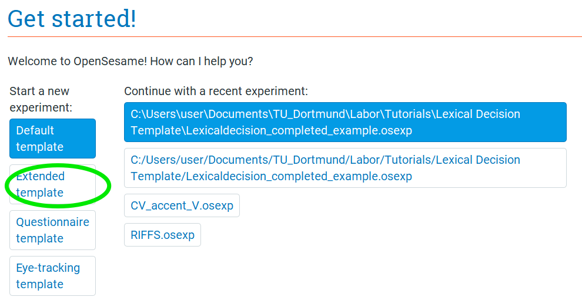

```

# Step 3: Choose the general properties of your experiment, remove unneeded sections

In the "General tab" that opens (also found when clicking Extended template on the Overview), you can change different properties of your experiment. We want to give our experiment a name, change the backend, change the resolution, and change the font size. Do the following:

* Change the name of the experiment from "Extended template" to "Word Spotting"
* Change the back-end to "psycho". 
* Set the resolution to that of the monitor you're using.
* Change the font size to 32 px.


```{r general_properties_image, echo= FALSE, out.width = "50%", fig.align="center"}

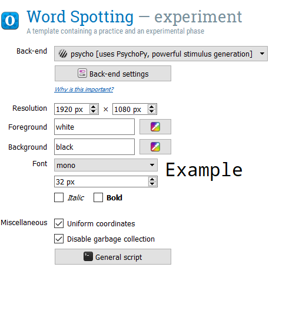

```


Delete the "practice_loop" loop and the "end_of_practice" sketchpad. If you want an extra challenge, you can add these back in later. They will still be available in your "Unused items". Also, delete the feedback and reset_feedback items. Your Overview should look like this:

```{r overview_bare_image, echo= FALSE, out.width = "50%", fig.align="center"}

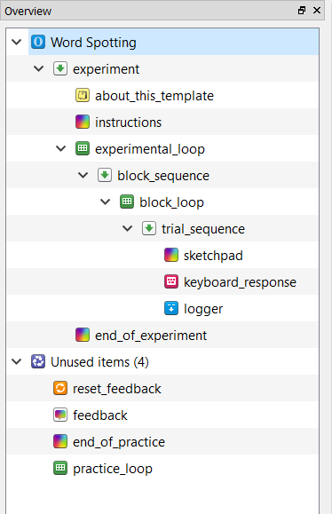

```

# Step 4: Add a sampler item to play an audio file

Drag a new sampler item into the experiment Overview, placing it into the "trial_sequence" as the first item. Using the "Browse" button, select the .wav file "aamaxflowshaxl.wav" from our file pool (folder "pool"). Change the Duration from "sound" to 0, so that Open Sesame does not wait until the end of the audio file to move on to the next item.

```{r new_sampler_image, echo= FALSE, out.width = "75%", fig.align="center"}

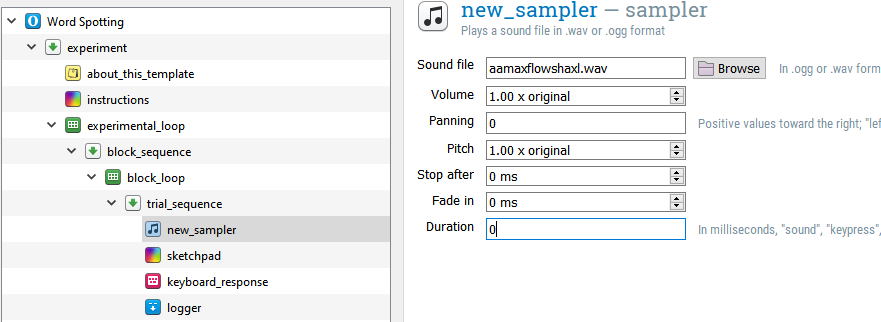

```


# Step 5: Change the keyboard_response timeout

Right now, they "keyboard_response" will wait until a button is pressed. But, not all trials require a button press (this is a go/no go expeirment). So, we want to wait on each trial an appropriate amount of time (let's say 4 seconds) before we move on to the next trial. Open the "keyboard_response" and in Timeout, type "4000".

# Step 6: Add a sound_recording item

We want to be able to have a recording of what the participant says when they think a trial contains a real word. In order to do that, we need to add "sound_start_recording" and a "sound_end_recording" items. If you're working on the lab laptop, they are already installed and you can find them in the commonly used plugins under the category "Response collection". Don't forget to press the arrow button at the bottom to expand the commonly used plugins :)

```{r new_plugins_download_image, echo= FALSE, out.width = "25%", fig.align="center"}

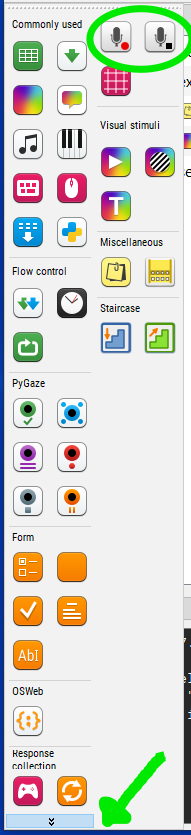

```

Add a sound_start_recording and a sound_stop_recording item after the keyboard_response.

```{r add_recording_image, echo= FALSE, out.width = "50%", fig.align="center"}

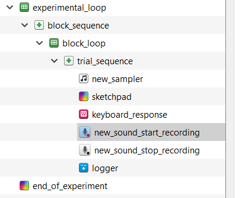

```

IMPORTANT: If you're working on your personal computer, you'll have to download the "sound_recording" plugin. You can find more information about this plugin [here](https://osdoc.cogsci.nl/3.2/manual/response/soundrecording/). Download the appropriate version of the sound_recorder plugin [here](https://github.com/dschreij/opensesame_soundrecorder_plugins/tags). For example, click on 
"v0.15", select "opensesame-plugins-soundrecorder_0.15-win32-py27.zip", and save the .zip file. 

```{r soundrecorder_download_image, echo= FALSE, out.width = "50%", fig.align="center"}

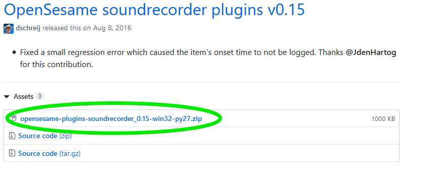

```

Unzip this file, and open the folder. Inside, there should be two folders: sound_start_recording and sound_stop_recording. Move these files to your Open Sesame plugins folder, which should be located at "C:\\Program Files (x86)\\OpenSesame\\share\\opensesame_plugins" or the Mac equivalent. Restart Open Sesame, and then open the experiment again. You should now have the two sound recording plugins under "Response collection". 


# Step 7: Configure the length of the recording for the sound_recording items

The way sound_recording is currently set up, however, the recording won't last long enough to cover what the participant actually says! Let's make sure that the recording will last long enough to cover what the participant actually says. In the plugins list, move an "advanced_delay" item between the "new_sound_start_recording" and "new_sound_end_recording" items. Set the duration to 5000 ms. Now, once the recording starts, it will record for 5 seconds until it stops recording.

```{r advanced_delay_image, echo= FALSE, out.width = "50%", fig.align="center"}

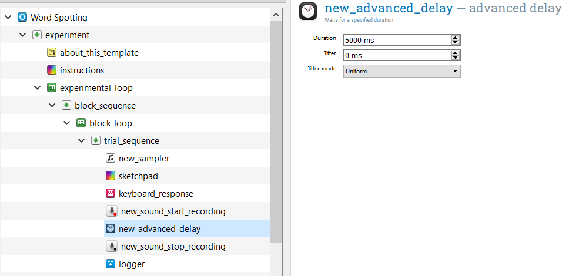

```

# Step 8: Set recording to be conditional on keyboard press

Now, we want to set up the recording to only take place if the participant pressed a button. To do so, we need to add a new sequence item. Drag one over and position it right after the "keyboard_response" item. Now, drag "new_sound_start_recording", "new_advanced_delay", and "new_sound_stop_recording" into this new sequence item. If a dialog appears, you want to inset *into* the sequence.


```{r new_sequence_image, echo= FALSE, out.width = "50%", fig.align="center"}

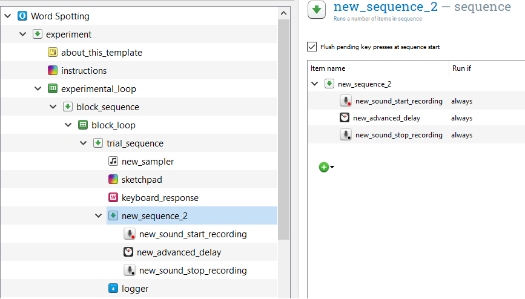

```


We only want this sequence to run if a button has been pressed. So, open up trial sequence and in the Run if column for our new sequence item, type [response_keyboard_response] = 'space'. Now, when the participant presses the space bar while listening to the wav file, it will start recording.

```{r runif_button_press_image, echo= FALSE, out.width = "50%", fig.align="center"}

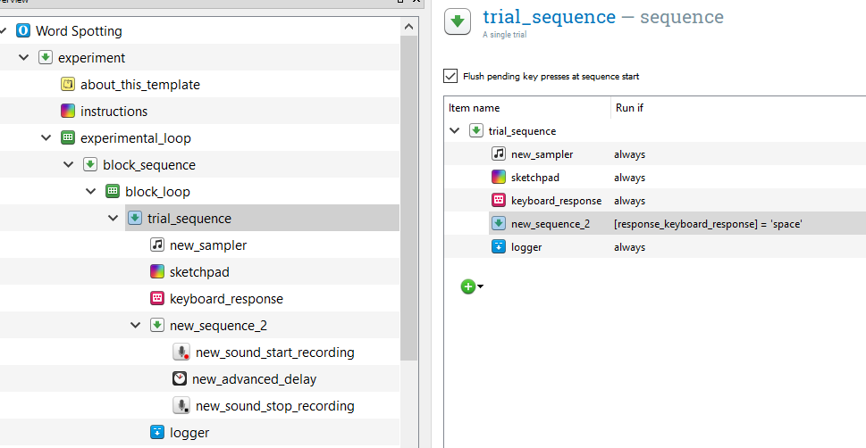

```

Finally, let's tell our participant to produce what they just heard. Add a sketchpad item to your new sequence item, before "sound_start_recording". Add the text "What word did you just hear?" and center it on the sketchpad. Set the Duration to 0, so that Open Sesame moves onto the next item, but this image stays on the screen.

# Step 9: Make a test-run of the experiment

We now have a very simple, one trial, but working experiment! Run yourself in the experiment. You'll probably hear a real word in our wav file "aamaxflowshaxl". Make sure you press the space bar and then say into your microphone the word that you heard. Then, when the experiment is finished, open the folder that "wordspotting_study" is saved in. There, you should see "default.wav". Open this file, and it should be a recording of you producing the word you heard.

The "completed" folder in the file you unzipped at the beginning of the tutorial contains the Open Sesame experiment "wordspotting_study_1st_test_run", which is the intermediate version of the experiment at this step.

# Step 10: Load and edit the stimuli list

When we started, we inspected the file "test_words.csv" that was included in our tutorial folder. Now, let's load that into Open Sesame using an inline script and convert it into a DataMatrix file. Drag an inline script into the beginning of the experiment. It is very important that you edit this code to contain the folder that your Open Sesame experiment is located in! Type in the following in the Run tab:

```{python}


# Comment out the following line until we're ready to run the experiment. This line takes the typed in subject number and converts it to a "var." variable to be used in the Open Sesame environment. We don't want to use that yet, because we won't be able to run our code!
#sub_num = str(var.subject_nr)
sub_num = 999

# load the os module
import os

# determine what folder the current experiment is in, call it "path"
# IMPORTANT! UPDATE THIS TO YOUR TUTORIAL FOLDER, OR WHEREVER FOLDER YOUR EXPERIMENT IS IN

path = "C:\\Users\\user\\Documents\\Github\\Kvonholzen.github.io\\Tutorials\\Word_Spotting\\Word_Spotting_Tutorial\\"

stimuli_file = path + "test_words.csv" 

# load the pandas module
import pandas
from datamatrix import DataMatrix, convert

# load the stimuli list
data = pandas.read_csv(stimuli_file, sep=",")

# convert the pandas object to a DataMatrix object
dm = convert.from_pandas(data)

print(dm)

```

We have two columns, category (word/nonword) and wav_file. Let's make a new column that we'll use to name recordings that participants may make during the experiment (they can't all be called default!).

```{python}

dm.recording = dm.wav_file

```

Also, we need to tell Open Sesame that our wav_file column contains files with a .wav extension.

```{python}

dm.wav_file = dm.wav_file + ".wav"

print(dm)

```


IMPORTANT: If you haven't installed the pandas module, you will need to do so in order to load the csv file. For more information about downloading modules in Open Sesame, [read this](https://osdoc.cogsci.nl/3.2/manual/environment/) The easiest method is to run the following code to install pandas:

```{python, eval = FALSE}

import pip

pip.main(['install', 'pandas'])


```

If you get an "Access denied" error, make sure you are running Open Sesame as an administrator.

# Step 11: Automatically create a new folder for recordings for each participant

For each participant that takes part in our experiment, we want to have a folder of their recordings afterwards, so that we can analyze them. In order to do that, we need to write some code to create a new folder every time a new participant is run. Type the following:

```{python}


# this is the current path (wherever you have the experiment saved)
path


# now, we want to create a new folder for this subject within the current folder
sub_path = path + "\subject_" + str(sub_num)

# create the folder if it doesn't exist

if not os.path.exists(sub_path):
    os.makedirs(sub_path)


```


# Step 13: Create a correct response, pseudorandomize and set up the experimental variables

In a previous tutorial (Lexical decision), you learned how to pseudorandomize the order of a DataMatrix object and then rename the variables in a loop to read the values of the DataMatrix. Now, its your turn to apply what you learned here. Refer back to the previous tutorial and complete the following:

**Create a "correct_response" column**
Since this is a go/no go experiment, the correct response for the nonword category is 'None' (meaning no button was pressed in the 4000 ms allowed for an answer) and for the word category it is 'space' (or whatever button you tell your participant to press).

**Pseudorandomize the order of trials**
Set a constraint that a particular category (word/nonword) can't be repeated more than 3 times.

**Set our DataMatrix object variables for the experimental "block_loop_1"**
This is the for loop with r_ticker and the exp.set() functions. Remember to change the code to reflect the names of variables we are using in this experiment (category, wav_file, recording, correct_response).

**Rename variables in "block_loop_1" to the environmental variables defined in our inline script**
Again, remember to change the names of the variables. Remember to set the Order to "sequential" so that Open Sesame doesn't step in and randomize our nice order. 


# Step 13: Set location and name of "sound_start_recording" item

Use the label of your recording column (I call it "exp_recording" in my block loop) as a variable for the Output Folder/File for your "sound_start_recording" item.

```{r exp_variable_name_image, echo= FALSE, out.width = "50%", fig.align="center"}

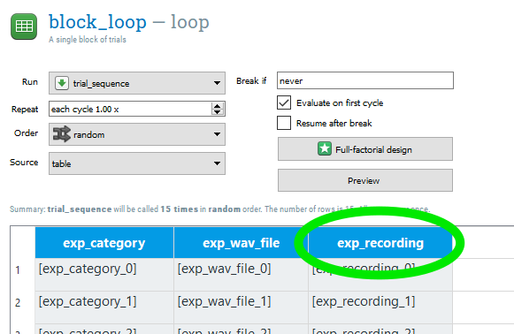

```

Combine this variable with your "sub_path" variable, with a slash in between to indicate that these files should be saved inside the subject recording folder. For example, I typed in "[sub_path]/[exp_recording]".

```{r recording_output_folder_image, echo= FALSE, out.width = "50%", fig.align="center"}

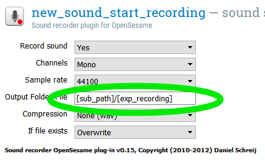

```


# Step 14: Set name of wav file for "sampler" item

Use the label of your recording column (I call it "exp_wav_fiile" in my block loop) as a variable for the Sound file for your "sampler" item.

```{r sampler_variable_image, echo= FALSE, out.width = "50%", fig.align="center"}

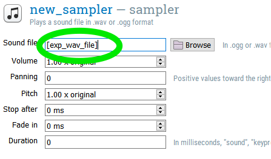

```


# Step 15: Change back to environment variables

Now that we have a working experiment, we can change our variables to be environmental variables. Do this for subject number and the location of our participant recording folder:

```{python eval = FALSE}

# Now that we're ready to run this experiment, commenting out #sub_num = 999
sub_num = str(var.subject_nr)
#sub_num = 999


# remember to add this in the inline script after sub_path has been defined!
var.sub_path = sub_path

```


# Step 16: Run the experiment!

Just as in the Beginner Tutorial and the previous running of this experiment, remember to use subject number "999" to get in the habit of not writing over important participant data files!

The "completed" folder in the file you unzipped at the beginning of the tutorial contains the Open Sesame experiment "wordspotting_study_2nd_test_run", which is the second intermediate version of the experiment at this step.


# Step 17: Add a custom log file

In a previous tutorial (Lexical decision), you learned how to add a custom log file. Now, its your turn to apply what you learned here. Refer back to the previous tutorial and add a custom log file. Dont' forget to edit our inline script to create the .csv log file and label its columns as well as add a new inline script at the end of the "trial_sequence" item to log all of our important variables. Remember, you want to record the following:

* subject identification code
* item information
* independent variable(s)
* dependent variable(s)
* trial number

As well as what button was pressed and which button was the correct one.

IMPORTANT! Place your inline script after the logger item, at the end of your trial_sequence object. If you place it in the new_sequence with the recording items, it will only log trials were the space bar is pressed. You can check this by clicking on your sequence items and inspecting their contents.

# Step 16: Finishing touches

Is there anything else you'd like to add to your experiment? A practice block? An instructions screen explaining the task to the participant? Remember, participants need to press the space bar in order to activate the recording sequence, so we should probably inform them of that!

The "completed" folder in the file you unzipped at the beginning of the tutorial contains the Open Sesame experiment "wordspotting_study_finished", which is my final version of this experiment after adding my custom log file and these finishing touches.

# References

