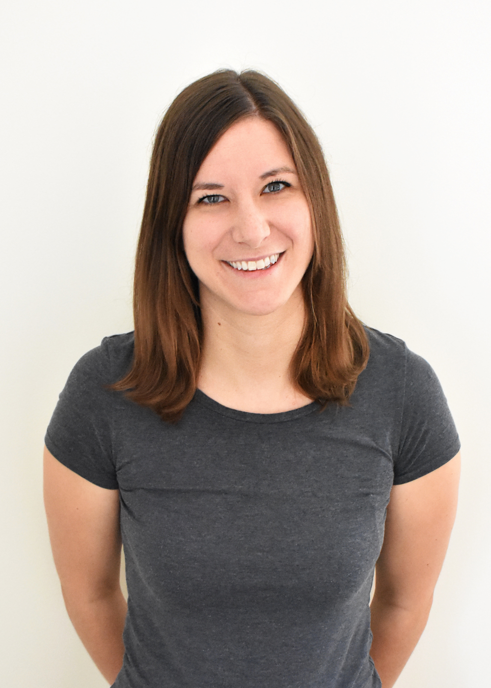

  

  

I'm a researcher in developmental psycholinguistics, currently working at the Technical University of Braunschweig in Germany. I've bounced all over the world since I started my PhD in Göttingen, Germany in 2010. You can read a brief summary of what I've worked on along the way under the [About Me](About_Me.html) tab. For a quick summary of my curriculum vitae, go to [CV](CV.html). You can find more about my current and past research projects under the [Research](Research.html) tab. I've taught several different classes in Psychology and Linguistics, you can check out some of my approaches under the [Teaching](Teaching.html) tab. I've also been covered in the media a few times and written a few blog posts, which you can read under the [Media](Medial.html) tab.

I've put together several tutorials for creating experiments (including online experiments!) in Open Sesame and for analyzing Eye-tracking and EEG data. You'll find these tutorials under the [Tutorials](Tutorials.html) drop-down menu.

Together with [Christina Bergmann](https://sites.google.com/site/chbergma/), we founded a regular meeting of the Parisian Babylabs every. Christina and I have both left Paris, but PaBaLa still meets every 2-3 months, discussing topics such as how to improve baby recruitment, best practices for planning and analyzing experiments, and tips for keeping babies happy and not fussy.  Check out the [website](https://sites.google.com/site/lscplpp/) to learn more!

 
 

----

Download my full [Curriculum Vitae](cv/K_Von_Holzen_CV.pdf) here

----

Check out my [Publons Reviewer Profile](https://publons.com/researcher/1230020/katie-von-holzen/peer-review/).

----